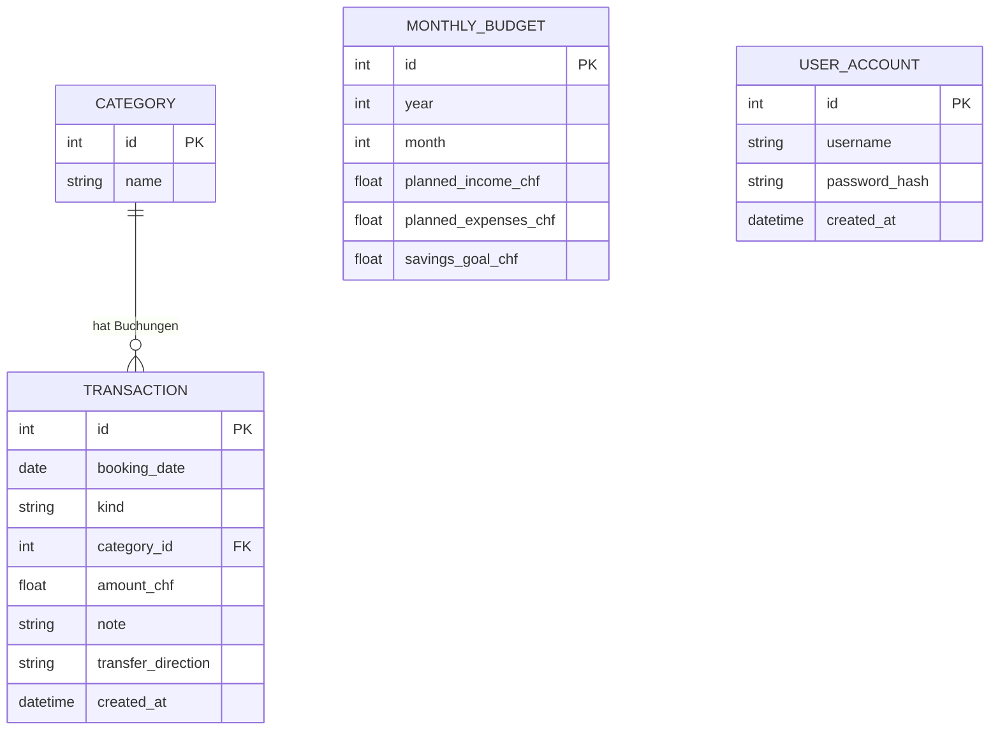
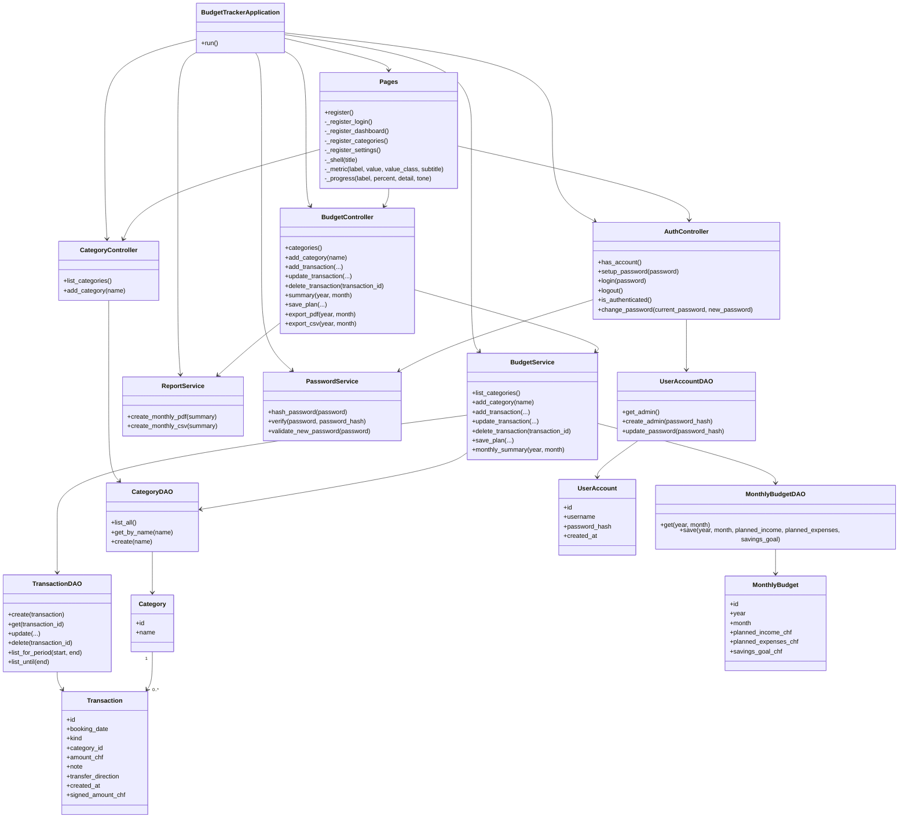

# Persönlicher Budget Tracker Webapp

Browserbasierte Weiterentwicklung des CLI-Projekts **Persönlicher Budget Tracker**. Die App ist ähnlich wie das Pizzeria-Referenzprojekt aufgebaut: NiceGUI als Oberfläche, Python für die Logik, SQLite als Datenbank und SQLModel als ORM.

## Projektidee

Viele Studierende und Berufseinsteiger möchten Einnahmen, Ausgaben, Sparziele und Monatsbudgets lokal verwalten, ohne externe Finanzsoftware zu nutzen. Diese Webapp macht den ursprünglichen Konsolen-Budgetplan als Browser-Anwendung nutzbar und zeigt direkt ein realistisches Beispielbudget mit Seed-Daten.

## User Stories

1. **Buchung erfassen**
   Als Benutzer möchte ich Einnahmen, Ausgaben und Umbuchungen mit Datum, Kategorie, Betrag und Notiz erfassen.

2. **Sparkonto umbuchen**
   Als Benutzer möchte ich Geld vom Budget zum Sparkonto oder vom Sparkonto zurück ins Budget umbuchen.

3. **Monatsübersicht sehen**
   Als Benutzer möchte ich Einnahmen, Ausgaben, genutztes Budget, Restbudget und Sparziel-Fortschritt für einen Monat sehen.

4. **Ausgaben analysieren**
   Als Benutzer möchte ich die grössten Kategorien, Prozentanteile, Diagramme und einen Monatsvergleich sehen.

5. **Buchungen suchen, filtern und bearbeiten**
   Als Benutzer möchte ich Buchungen nach Text, Typ und Kategorie filtern sowie bestehende Einträge editieren oder löschen.

6. **Budgetplan speichern**
   Als Benutzer möchte ich geplante Einnahmen, geplante Ausgaben und ein Sparziel pro Monat speichern.

7. **Berichte exportieren**
   Als Benutzer möchte ich Monatsberichte als PDF und Buchungsdaten als CSV exportieren.

8. **Passwortschutz verwenden**
   Als Benutzer möchte ich die App mit einem Passwort schützen und das Passwort später ändern.

## Use Cases

- **App starten und anmelden:** Benutzer öffnet die Webapp, richtet beim ersten Start ein Passwort ein oder meldet sich mit bestehendem Passwort an.
- **Monat auswerten:** Benutzer wählt Jahr und Monat aus und sieht Kennzahlen, Diagramme, Budgetwarnungen und Spartipps.
- **Buchung erfassen:** Benutzer erfasst Einnahmen, Ausgaben oder Umbuchungen mit Datum, Betrag und Notiz.
- **Kategorie verwalten:** Benutzer fügt direkt beim Erfassen einer Buchung eine neue Kategorie hinzu.
- **Buchung korrigieren:** Benutzer bearbeitet oder löscht bestehende Buchungen in der Tabelle.
- **Budget planen:** Benutzer speichert geplante Einnahmen, geplante Ausgaben und Sparziel für einen Monat.
- **Daten finden:** Benutzer sucht und filtert Buchungen nach Text, Typ und Kategorie.
- **Bericht exportieren:** Benutzer exportiert Monatsdaten als PDF-Bericht oder CSV-Datei.

## Funktionen

- Browser-App mit NiceGUI
- Passwort-Setup, Login und Passwortänderung
- Realistische Seed-Daten mit 12 Monatsbudgets und über 100 Beispielbuchungen
- Einnahmen, Ausgaben und Umbuchungen erfassen
- Umbuchungen zwischen Budget und Sparkonto
- Kategorien direkt beim Erfassen einer Buchung hinzufügen
- Buchungen editieren und löschen
- Suche und Filter nach Text, Typ und Kategorie
- Dashboard mit Einnahmen, Ausgaben, Restbudget, grösster Kategorie, Monatsvergleich und Netto-Sparen
- Budget-Health-Score mit einfacher Bewertung des Monats
- Nettovermögen, Budgetkonto und Sparkonto als getrennte Kennzahlen
- Tagesbudget: zeigt, wie viel pro Tag bis Monatsende noch frei ist
- Erkennung wiederkehrender Ausgaben mit geschätzten Jahreskosten
- Kreisdiagramm für Ausgaben-Verteilung
- Balkendiagramm für Monatsvergleich
- Budget-Limite mit Warnung ab 80 Prozent und bei Überschreitung
- Sparziel-Fortschritt und einfache automatische Spartipps
- PDF-Bericht und CSV-Export
- SQLite-Datenbank via SQLModel ORM
- Tests für Geschäftslogik, Datenbankzugriff und Integration

## Bedienung

Beim ersten Start wird ein Passwort eingerichtet. Danach kann man sich anmelden und die App lokal im Browser nutzen.

Im Dashboard wird ein Monat ausgewählt. Danach zeigt die App Kennzahlen, Diagramme, Budgetwarnungen, Spartipps und die Buchungen dieses Monats.

Neue Buchungen werden im Bereich **Neue Buchung** erfasst:

- **Einnahme:** Geld kommt ins Budget.
- **Ausgabe:** Geld wird ausgegeben.
- **Umbuchung:** Geld wird zwischen Budget und Sparkonto verschoben.

Bei einer Umbuchung wird automatisch die Kategorie **Sparkonto** angezeigt. Die Richtung bestimmt die Wirkung:

- **Budget zu Sparkonto:** reduziert das verfügbare Budget und erhöht den Sparfortschritt.
- **Sparkonto zu Budget:** erhöht das verfügbare Budget und reduziert den Netto-Sparbetrag.

## Aufbau der App

- **Domain:** Datenmodelle für Transaktionen, Kategorien, Budgetpläne und Einstellungen.
- **Data Access:** Datenbankverbindung, Tabellenaufbau, Seed-Daten und DAO-Klassen.
- **Services:** Businesslogik, Validierung, Passwortschutz, Berechnungen und Exporte.
- **UI:** NiceGUI-Seiten und Controller für Dashboard, Formulare, Tabellen und Aktionen.
- **Tests:** Unit-, Datenbank- und Integrationstests.

<<<<<<< HEAD
=======
## ER-Diagramm

### Erklärung des ER-Diagramms

- **Category** speichert die Buchungskategorien wie Miete, Lebensmittel, Transport oder Sparkonto.
- **Transaction** speichert einzelne Buchungen. Jede Buchung gehört genau zu einer Kategorie.
- **MonthlyBudget** speichert die geplanten Werte pro Monat: geplante Einnahmen, geplante Ausgaben und Sparziel.
- **UserAccount** speichert den lokalen Benutzer für den Passwortschutz.
- Die Beziehung zwischen **Category** und **Transaction** ist eine 1:n-Beziehung: Eine Kategorie kann viele Buchungen haben, eine Buchung hat aber nur eine Kategorie.

## Klassendiagramm

### Erklärung des Klassendiagramms

- **Pages** enthält die NiceGUI-Seiten und bildet die sichtbare Oberfläche der App.
- **AuthController**, **BudgetController** und **CategoryController** verbinden die Oberfläche mit der Applikationslogik.
- **BudgetService** verarbeitet Buchungen, Monatspläne, Umbuchungen, Auswertungen und Kategorien.
- **ReportService** erstellt PDF-Berichte und CSV-Exporte.
- **PasswordService** übernimmt Passwort-Hashing, Passwortprüfung und Passwortvalidierung.
- Die DAO-Klassen kapseln den Datenbankzugriff, damit die Oberfläche nicht direkt mit der Datenbank arbeitet.
- Die Model-Klassen **Category**, **Transaction**, **MonthlyBudget** und **UserAccount** bilden die Datenbanktabellen ab.
- Dadurch bleiben Präsentationsschicht, Businesslogik und Datenbankzugriff klar getrennt.

>>>>>>> 7739468 (Apply Tailwind-oriented UI polish)
## Design-Entscheidungen

- **Schichtenarchitektur:** Oberfläche, Controller, Services, Datenzugriff und Modelle sind getrennt. Dadurch bleibt die Businesslogik testbar.
- **NiceGUI als Browser-Frontend:** Die App läuft im Browser, wird aber serverseitig mit Python aufgebaut. Das passt zur Modulvorgabe.
- **Tailwind-orientiertes Styling:** Layout, Karten, Abstände, Farben und responsive Grids werden mit Tailwind-Utility-Klassen umgesetzt. Eigenes CSS wird nur dort ergänzt, wo NiceGUI-spezifische Details oder Progress-Balken sauberer steuerbar sind.
- **SQLite + SQLModel:** SQLite ist für eine lokale Budget-App einfach zu starten. SQLModel wird als ORM verwendet.
- **Sparkonto als Umbuchung:** Sparen wird nicht als normale Ausgabe behandelt. Stattdessen gibt es Umbuchungen zwischen Monatsbudget und Sparkonto.
- **Seed-Daten:** Neue Benutzer sehen sofort ein vollständiges Beispielbudget. Dadurch können Dashboard, Diagramme und Filter direkt getestet werden.
- **Tests:** Die Tests sind in Unit-, DB- und Integrationstests aufgeteilt, damit Logik, Persistenz und Gesamtfluss getrennt geprüft werden.

## Vergleich mit Budget-Apps

Die App übernimmt bewusst passende Ideen aus bekannten Budgetplanern:

- **YNAB:** Monatsplan, Budgetziele, Sparziel-Fortschritt, Auswertungen und klare Budgetwarnungen.
- **Actual Budget:** lokale Datenhaltung, SQLite-Datenbank, Umbuchungen, Export und Fokus auf Kontrolle über die eigenen Daten.
- **Copilot Money:** Dashboard-Kennzahlen, Filter, Cashflow, Sparkonto-Logik, wiederkehrende Ausgaben und einfache automatische Hinweise.

Nicht umgesetzt sind Bank-Sync, echte Mehrbenutzer-Synchronisation, Investments und automatische Bank-Importe. Diese Punkte wären für ein Schulprojekt deutlich grösser und werden deshalb als Erweiterungen betrachtet.

## Oberfläche, Dashboard, Diagramme und Export

Die Oberfläche wurde mit NiceGUI umgesetzt. Die UI-Komponenten werden in Python erstellt und im Browser angezeigt. Für das Design werden NiceGUI-Komponenten mit Tailwind-Utility-Klassen kombiniert, zum Beispiel für responsive Grids, Karten, Schatten, Abstände und Farbabstufungen. Eigenes CSS wird ergänzend für projektbezogene Details wie Progress-Balken, Tabellen und kleine Textstile verwendet. Dadurch wirkt die App nicht mehr wie eine unveränderte Standard-NiceGUI-Oberfläche.

Das Dashboard ist die zentrale Übersichtsseite der Anwendung. Es fasst die wichtigsten Budgetinformationen eines ausgewählten Monats zusammen:

- Einnahmen und Ausgaben
- Monats-Cashflow
- Budgetkonto und Sparkonto
- Nettovermögen
- Restbudget und Tagesbudget
- Budget-Health-Score
- Sparziel-Fortschritt
- grösste Ausgabenkategorie mit Betrag und Prozentanteil
- wiederkehrende Ausgaben
- Monatsvergleich

Die Diagramme unterstützen die visuelle Auswertung:

- **Ausgaben-Verteilung:** zeigt, welche Kategorien den grössten Anteil an den Ausgaben haben.
- **Monatsvergleich:** vergleicht den aktuellen Monat mit dem Vormonat.

Die Export-Funktionen werden direkt über die Oberfläche ausgelöst:

- **PDF-Bericht:** erstellt einen Monatsbericht mit Kennzahlen und Buchungen.
- **CSV-Export:** exportiert die Buchungen eines Monats als Tabelle.

Die Oberfläche ruft dafür Controller und Services auf. Die Dateierstellung selbst liegt im **ReportService**, damit UI und Businesslogik getrennt bleiben.

## Projektmanagement und Arbeitsaufteilung

- **Boran:** Datenmodell, SQLModel-Modelle, DAO-Schicht und Seed-Daten
- **Mouad:** Businesslogik, Validierung, Budgetberechnung, Umbuchungen und Tests
- **Eleonora:** NiceGUI-Oberfläche, Dashboard, Diagramme, Export und Dokumentation

Die Entwicklung sollte über GitHub-Commits nachvollziehbar sein. Für die Präsentation sollten alle Teammitglieder ihren Codebereich erklären können.

## Verwendete Bibliotheken

- **NiceGUI:** Browser-Oberfläche
- **SQLModel und SQLAlchemy:** ORM und Datenbankzugriff
- **ReportLab:** PDF-Berichte
- **Pytest:** Tests

## Installation und Start

1. Virtuelle Umgebung erstellen: `python -m venv .venv`
2. Umgebung aktivieren: `.\.venv\Scripts\Activate.ps1`
3. Abhängigkeiten installieren: `pip install -r requirements.txt`
4. App starten: `python -m budget_tracker_app`
5. Im Browser öffnen: `http://localhost:8080`

## Tests

Die Tests werden mit `python -m pytest` gestartet.

Die geforderte Mindeststruktur ist erfüllt:

- 12 Tests insgesamt
- 6 Unit-Tests
- 3 Datenbanktests
- 3 Integrationstests

## Projektanforderungen SS26

- **NiceGUI Browser-App:** Die App läuft im Browser, die UI wird serverseitig mit Python aufgebaut.
- **Objektorientierung:** Modelle, Services, Controller, DAOs und App-Komposition sind als Klassen strukturiert.
- **ORM/Datenbank:** Daten werden in SQLite gespeichert und über SQLModel verwaltet.
- **Validierung:** Datum, Betrag, Kategorie, Passwort, Umbuchung und Budgetplan werden geprüft.
- **Seed-Daten:** Die App zeigt beim Start ein vollständiges Beispielbudget.
- **Analysen:** Dashboard, Diagramme, Monatsvergleich, Budgetwarnung und Spartipps helfen beim Budget-Tracking.
- **Erweiterte Auswertung:** Nettovermögen, Budget-Health-Score, Tagesbudget und wiederkehrende Ausgaben machen die App vergleichbarer mit modernen Budgetplanern.
- **Export:** Monatsberichte können als PDF und CSV erstellt werden.
- **Dokumentation:** README beschreibt Ziel, Funktionen, Architektur, Bedienung und Tests.

## Mögliche Erweiterungen

Folgende Punkte sind bewusst als Erweiterung eingeordnet, weil sie ein grösseres Benutzer- und Rechtekonzept brauchen:

- Rollen-System, z.B. Admin darf bearbeiten, Viewer darf nur ansehen
- Benutzerprofil mit mehreren Benutzern
- Benachrichtigungen mit gespeicherten Regeln

## NiceGUI-Oberfläche, Dashboard, Diagramme, Export und Dokumentation

Dieser Projektbeitrag befindet sich hauptsächlich in der Präsentationsschicht der Anwendung. Der Schwerpunkt liegt auf der NiceGUI-Oberfläche, dem Tailwind-Design, dem Dashboard, den Diagrammen, der Export-Auslösung über die Benutzeroberfläche und der README-Dokumentation.

### Umgesetzte Aufgaben

* NiceGUI-Seiten in `budget_tracker_app/ui/pages.py` wurden aufgebaut und angepasst
* Die Benutzeroberfläche wurde mit Tailwind-Utility-Klassen über `.classes()` gestaltet
* Layout, Abstände, Karten, Typografie, Farben und responsive Bereiche wurden umgesetzt
* Das Dashboard wurde mit Kennzahlen, Tabellen und Auswertungsbereichen aufgebaut
* Diagramme für Ausgabenverteilung und Monatsvergleich wurden dargestellt
* Export-Aktionen für PDF-Berichte und CSV-Dateien wurden in die Benutzeroberfläche eingebunden
* Die Benutzerführung wurde durch klare Seitenbereiche, Formulare, Tabellen und Statusmeldungen verbessert
* Die README-Dokumentation wurde mit Architektur-, Design- und Diagramminformationen ergänzt und gepflegt

### NiceGUI- und Tailwind-Design

Die Oberfläche wurde mit NiceGUI umgesetzt. Die UI-Komponenten werden in Python erstellt und im Browser dargestellt. Für das visuelle Design werden hauptsächlich Tailwind-Utility-Klassen direkt über `.classes()` verwendet.

Beispiele für verwendete Tailwind-Klassen:

| Bereich           | Verwendete Klassen                                                                      |
| ----------------- | --------------------------------------------------------------------------------------- |
| Layout            | `grid`, `flex`, `w-full`, `max-w-7xl`, `mx-auto`                                        |
| Responsive Design | `grid-cols-1`                                                                           |
| Abstände          | `p-4`, `p-5`, `px-4`, `py-6`, `gap-3`, `gap-4`                                          |
| Karten / Panels   | `bg-white`, `border`, `rounded-2xl`, `shadow-md`                                        |
| Typografie        | `text-sm`, `text-xl`, `text-2xl`, `text-3xl`, `font-bold`, `font-semibold`              |
| Farben            | `text-slate-500`, `text-emerald-700`, `text-red-700`, `text-blue-700`, `text-amber-700` |

Eigenes CSS wird nur für spezielle Elemente verwendet, bei denen Tailwind-Klassen allein nicht sinnvoll ausreichen, zum Beispiel für Progress-Bars oder Tabellenbereiche. Der Hauptteil des Designs bleibt dadurch direkt im NiceGUI-Code sichtbar.

### Dashboard

Das Dashboard bildet die zentrale Übersichtsseite der Anwendung. Es fasst die wichtigsten Budgetinformationen eines ausgewählten Monats zusammen.

Enthaltene Dashboard-Bereiche:

* Einnahmen
* Ausgaben
* Cashflow
* Budgetkonto
* Sparkonto
* Nettovermögen
* Restbudget
* Tagesbudget
* Budget-Health-Score
* Sparziel-Fortschritt
* grösste Ausgabenkategorie
* wiederkehrende Ausgaben
* Monatsvergleich

Die Darstellung erfolgt über Karten, Tabellen, Fortschrittsanzeigen und Diagramme. Dadurch können wichtige Finanzinformationen schnell erfasst werden, ohne dass alle Buchungen einzeln analysiert werden müssen.

### Diagramme

Die Diagramme unterstützen die visuelle Auswertung der Budgetdaten.

Umgesetzte Diagramme:

1. **Ausgabenverteilung nach Kategorie**

   * zeigt die Verteilung der Ausgaben im ausgewählten Monat
   * macht sichtbar, welche Kategorien den grössten Anteil an den Ausgaben haben

2. **Monatsvergleich**

   * zeigt Einnahmen, Ausgaben und Sparverhalten im Vergleich
   * unterstützt die Analyse der finanziellen Entwicklung über mehrere Monate

Die Diagramme ergänzen die tabellarische Darstellung und verbessern die Verständlichkeit der Budgetauswertung.

### Export

Die Export-Funktionen werden über die NiceGUI-Oberfläche ausgelöst.

Umgesetzte Exporte:

| Export      | Beschreibung                                                  |
| ----------- | ------------------------------------------------------------- |
| PDF-Bericht | Erstellt einen Monatsbericht mit Kennzahlen und Transaktionen |
| CSV-Export  | Exportiert Buchungen eines Monats in eine CSV-Datei           |

Die Benutzeroberfläche stellt die Buttons und Rückmeldungen für den Export bereit. Die eigentliche Dateierstellung erfolgt über den `ReportService`.

### Abgrenzung des Beitrags

Die Oberfläche greift nicht direkt auf die Datenbank zu. Benutzeraktionen werden in der NiceGUI-Oberfläche ausgelöst und danach über Controller und Services verarbeitet. Dadurch bleibt die Präsentationsschicht von Businesslogik und Datenbankzugriff getrennt.

Betroffene Bereiche:

* `budget_tracker_app/ui/pages.py`
* Dashboard-Layout
* Diagramm-Darstellung
* Export-Buttons und Export-Benutzerführung
* Tailwind-Design
* README-Dokumentation

## ER-Diagramm

Das folgende ER-Diagramm zeigt das Datenmodell der Anwendung. Es dokumentiert Tabellen, Primärschlüssel, Fremdschlüssel und die Beziehung zwischen Kategorien und Buchungen.

### Erklärung des ER-Diagramms

* `Category` speichert die Kategorien für Buchungen.
* `Transaction` speichert Einnahmen, Ausgaben und Umbuchungen.
* Jede `Transaction` verweist über `category_id` auf genau eine `Category`.
* `MonthlyBudget` speichert geplante Monatswerte wie Einnahmen, Ausgaben und Sparziel.
* `UserAccount` speichert den lokalen Benutzer für den Passwortschutz.
* Die Beziehung zwischen `Category` und `Transaction` ist eine 1:n-Beziehung: Eine Kategorie kann mehrere Buchungen enthalten, eine Buchung gehört jedoch zu genau einer Kategorie.

## Klassendiagramm

Das Klassendiagramm zeigt die wichtigsten Klassen und ihre Zusammenarbeit. Der Fokus liegt auf der Verbindung zwischen Oberfläche, Controller, Services, DAOs und Datenmodell.

### Erklärung des Klassendiagramms

* `Pages` enthält die NiceGUI-Seiten und bildet den zentralen Teil der Oberfläche.
* `AuthController`, `BudgetController` und `CategoryController` verbinden die Oberfläche mit der Applikationslogik.
* `BudgetService` verarbeitet Budgetdaten, Buchungen, Monatsauswertungen und Kategorien.
* `ReportService` erstellt PDF- und CSV-Exporte.
* `PasswordService` übernimmt Passwort-Hashing, Passwortprüfung und Validierung.
* Die DAO-Klassen kapseln den Datenbankzugriff.
* Die Model-Klassen `Category`, `Transaction`, `MonthlyBudget` und `UserAccount` bilden die Datenbanktabellen ab.
* Die Oberfläche bleibt von Datenbankzugriff und Businesslogik getrennt.
