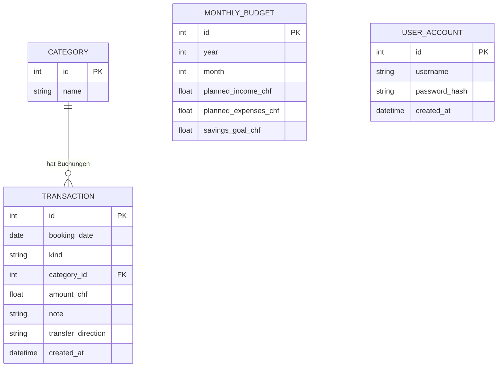
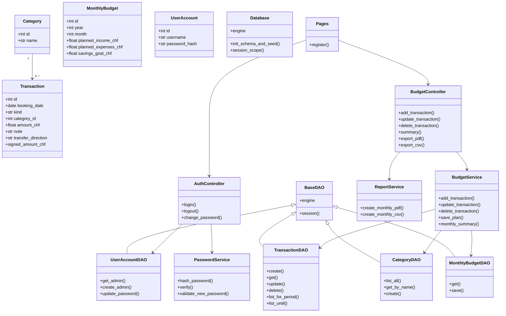

# Persönlicher Budget Tracker Webapp

Browserbasierte Weiterentwicklung des CLI-Projekts **Persönlicher Budget Tracker**. Die App ist ähnlich wie das Pizzeria-Referenzprojekt aufgebaut: NiceGUI als Oberfläche, Python für die Logik, SQLite als Datenbank und SQLModel als ORM.

## Projektidee

Viele Studierende und Berufseinsteiger möchten Einnahmen, Ausgaben, Sparziele und Monatsbudgets lokal verwalten, ohne externe Finanzsoftware zu nutzen. Diese Webapp macht den ursprünglichen Konsolen-Budgetplan als Browser-Anwendung nutzbar und zeigt direkt ein realistisches Beispielbudget mit Seed-Daten.

## User Stories

1. **Buchung erfassen**
   Als Benutzer möchte ich Einnahmen, Ausgaben und Umbuchungen mit Datum, Kategorie, Betrag und Notiz erfassen.

2. **Sparkonto umbuchen**
   Als Benutzer möchte ich Geld vom Budget zum Sparkonto oder vom Sparkonto zurück ins Budget umbuchen.

3. **Monatsübersicht sehen**
   Als Benutzer möchte ich Einnahmen, Ausgaben, genutztes Budget, Restbudget und Sparziel-Fortschritt für einen Monat sehen.

4. **Ausgaben analysieren**
   Als Benutzer möchte ich die grössten Kategorien, Prozentanteile, Diagramme und einen Monatsvergleich sehen.

5. **Buchungen suchen, filtern und bearbeiten**
   Als Benutzer möchte ich Buchungen nach Text, Typ und Kategorie filtern sowie bestehende Einträge editieren oder löschen.

6. **Budgetplan speichern**
   Als Benutzer möchte ich geplante Einnahmen, geplante Ausgaben und ein Sparziel pro Monat speichern.

7. **Berichte exportieren**
   Als Benutzer möchte ich Monatsberichte als PDF und Buchungsdaten als CSV exportieren.

8. **Passwortschutz verwenden**
   Als Benutzer möchte ich die App mit einem Passwort schützen und das Passwort später ändern.

## Use Cases

- **App starten und anmelden:** Benutzer öffnet die Webapp, richtet beim ersten Start ein Passwort ein oder meldet sich mit bestehendem Passwort an.
- **Monat auswerten:** Benutzer wählt Jahr und Monat aus und sieht Kennzahlen, Diagramme, Budgetwarnungen und Spartipps.
- **Buchung erfassen:** Benutzer erfasst Einnahmen, Ausgaben oder Umbuchungen mit Datum, Betrag und Notiz.
- **Kategorie verwalten:** Benutzer fügt direkt beim Erfassen einer Buchung eine neue Kategorie hinzu.
- **Buchung korrigieren:** Benutzer bearbeitet oder löscht bestehende Buchungen in der Tabelle.
- **Budget planen:** Benutzer speichert geplante Einnahmen, geplante Ausgaben und Sparziel für einen Monat.
- **Daten finden:** Benutzer sucht und filtert Buchungen nach Text, Typ und Kategorie.
- **Bericht exportieren:** Benutzer exportiert Monatsdaten als PDF-Bericht oder CSV-Datei.

## Funktionen

- Browser-App mit NiceGUI
- Passwort-Setup, Login und Passwortänderung
- Realistische Seed-Daten mit 12 Monatsbudgets und über 100 Beispielbuchungen
- Einnahmen, Ausgaben und Umbuchungen erfassen
- Umbuchungen zwischen Budget und Sparkonto
- Kategorien direkt beim Erfassen einer Buchung hinzufügen
- Buchungen editieren und löschen
- Suche und Filter nach Text, Typ und Kategorie
- Dashboard mit Einnahmen, Ausgaben, Restbudget, grösster Kategorie, Monatsvergleich und Netto-Sparen
- Budget-Health-Score mit einfacher Bewertung des Monats
- Nettovermögen, Budgetkonto und Sparkonto als getrennte Kennzahlen
- Tagesbudget: zeigt, wie viel pro Tag bis Monatsende noch frei ist
- Erkennung wiederkehrender Ausgaben mit geschätzten Jahreskosten
- Kreisdiagramm für Ausgaben-Verteilung
- Balkendiagramm für Monatsvergleich
- Budget-Limite mit Warnung ab 80 Prozent und bei Überschreitung
- Sparziel-Fortschritt und einfache automatische Spartipps
- PDF-Bericht und CSV-Export
- SQLite-Datenbank via SQLModel ORM
- Tests für Geschäftslogik, Datenbankzugriff und Integration

## Bedienung

Beim ersten Start wird ein Passwort eingerichtet. Danach kann man sich anmelden und die App lokal im Browser nutzen.

Im Dashboard wird ein Monat ausgewählt. Danach zeigt die App Kennzahlen, Diagramme, Budgetwarnungen, Spartipps und die Buchungen dieses Monats.

Neue Buchungen werden im Bereich **Neue Buchung** erfasst:

- **Einnahme:** Geld kommt ins Budget.
- **Ausgabe:** Geld wird ausgegeben.
- **Umbuchung:** Geld wird zwischen Budget und Sparkonto verschoben.

Bei einer Umbuchung wird automatisch die Kategorie **Sparkonto** angezeigt. Die Richtung bestimmt die Wirkung:

- **Budget zu Sparkonto:** reduziert das verfügbare Budget und erhöht den Sparfortschritt.
- **Sparkonto zu Budget:** erhöht das verfügbare Budget und reduziert den Netto-Sparbetrag.

## Aufbau der App

- **Domain:** Datenmodelle für Transaktionen, Kategorien, Budgetpläne und Einstellungen.
- **Data Access:** Datenbankverbindung, Tabellenaufbau, Seed-Daten und DAO-Klassen.
- **Services:** Businesslogik, Validierung, Passwortschutz, Berechnungen und Exporte.
- **UI:** NiceGUI-Seiten und Controller für Dashboard, Formulare, Tabellen und Aktionen.
- **Tests:** Unit-, Datenbank- und Integrationstests.

## ER-Diagramm

## Klassendiagramm

## Design-Entscheidungen

- **Schichtenarchitektur:** Oberfläche, Controller, Services, Datenzugriff und Modelle sind getrennt. Dadurch bleibt die Businesslogik testbar.
- **NiceGUI als Browser-Frontend:** Die App läuft im Browser, wird aber serverseitig mit Python aufgebaut. Das passt zur Modulvorgabe.
- **SQLite + SQLModel:** SQLite ist für eine lokale Budget-App einfach zu starten. SQLModel wird als ORM verwendet.
- **Sparkonto als Umbuchung:** Sparen wird nicht als normale Ausgabe behandelt. Stattdessen gibt es Umbuchungen zwischen Monatsbudget und Sparkonto.
- **Seed-Daten:** Neue Benutzer sehen sofort ein vollständiges Beispielbudget. Dadurch können Dashboard, Diagramme und Filter direkt getestet werden.
- **Tests:** Die Tests sind in Unit-, DB- und Integrationstests aufgeteilt, damit Logik, Persistenz und Gesamtfluss getrennt geprüft werden.

## Vergleich mit Budget-Apps

Die App übernimmt bewusst passende Ideen aus bekannten Budgetplanern:

- **YNAB:** Monatsplan, Budgetziele, Sparziel-Fortschritt, Auswertungen und klare Budgetwarnungen.
- **Actual Budget:** lokale Datenhaltung, SQLite-Datenbank, Umbuchungen, Export und Fokus auf Kontrolle über die eigenen Daten.
- **Copilot Money:** Dashboard-Kennzahlen, Filter, Cashflow, Sparkonto-Logik, wiederkehrende Ausgaben und einfache automatische Hinweise.

Nicht umgesetzt sind Bank-Sync, echte Mehrbenutzer-Synchronisation, Investments und automatische Bank-Importe. Diese Punkte wären für ein Schulprojekt deutlich grösser und werden deshalb als Erweiterungen betrachtet.

## Projektmanagement und Arbeitsaufteilung

- **Boran:** Datenmodell, SQLModel-Modelle, DAO-Schicht und Seed-Daten
- **Mouad:** Businesslogik, Validierung, Budgetberechnung, Umbuchungen und Tests
- **Eleonora:** NiceGUI-Oberfläche, Dashboard, Diagramme, Export und Dokumentation

Die Entwicklung sollte über GitHub-Commits nachvollziehbar sein. Für die Präsentation sollten alle Teammitglieder ihren Codebereich erklären können.

## Verwendete Bibliotheken

- **NiceGUI:** Browser-Oberfläche
- **SQLModel und SQLAlchemy:** ORM und Datenbankzugriff
- **ReportLab:** PDF-Berichte
- **Pytest:** Tests

## Installation und Start

1. Virtuelle Umgebung erstellen: `python -m venv .venv`
2. Umgebung aktivieren: `.\.venv\Scripts\Activate.ps1`
3. Abhängigkeiten installieren: `pip install -r requirements.txt`
4. App starten: `python -m budget_tracker_app`
5. Im Browser öffnen: `http://localhost:8080`

Falls die mitgelieferte lokale Umgebung verwendet wird, kann direkt `.\.venv312\Scripts\Activate.ps1` genutzt werden.

## Tests

Die Tests werden mit `python -m pytest` gestartet.

Die geforderte Mindeststruktur ist erfüllt:

- 12 Tests insgesamt
- 6 Unit-Tests
- 3 Datenbanktests
- 3 Integrationstests

## Projektanforderungen SS26

- **NiceGUI Browser-App:** Die App läuft im Browser, die UI wird serverseitig mit Python aufgebaut.
- **Objektorientierung:** Modelle, Services, Controller, DAOs und App-Komposition sind als Klassen strukturiert.
- **ORM/Datenbank:** Daten werden in SQLite gespeichert und über SQLModel verwaltet.
- **Validierung:** Datum, Betrag, Kategorie, Passwort, Umbuchung und Budgetplan werden geprüft.
- **Seed-Daten:** Die App zeigt beim Start ein vollständiges Beispielbudget.
- **Analysen:** Dashboard, Diagramme, Monatsvergleich, Budgetwarnung und Spartipps helfen beim Budget-Tracking.
- **Erweiterte Auswertung:** Nettovermögen, Budget-Health-Score, Tagesbudget und wiederkehrende Ausgaben machen die App vergleichbarer mit modernen Budgetplanern.
- **Export:** Monatsberichte können als PDF und CSV erstellt werden.
- **Dokumentation:** README beschreibt Ziel, Funktionen, Architektur, Bedienung und Tests.

## Mögliche Erweiterungen

Folgende Punkte sind bewusst als Erweiterung eingeordnet, weil sie ein grösseres Benutzer- und Rechtekonzept brauchen:

- Rollen-System, z.B. Admin darf bearbeiten, Viewer darf nur ansehen
- Benutzerprofil mit mehreren Benutzern
- Benachrichtigungen mit gespeicherten Regeln
